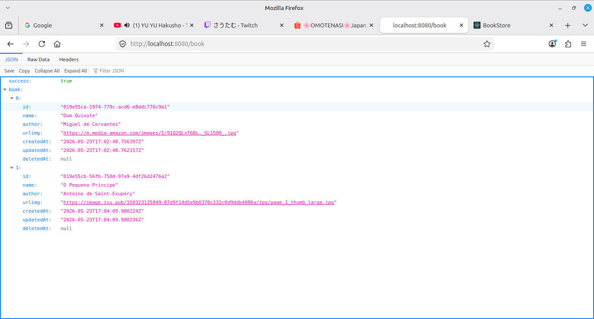
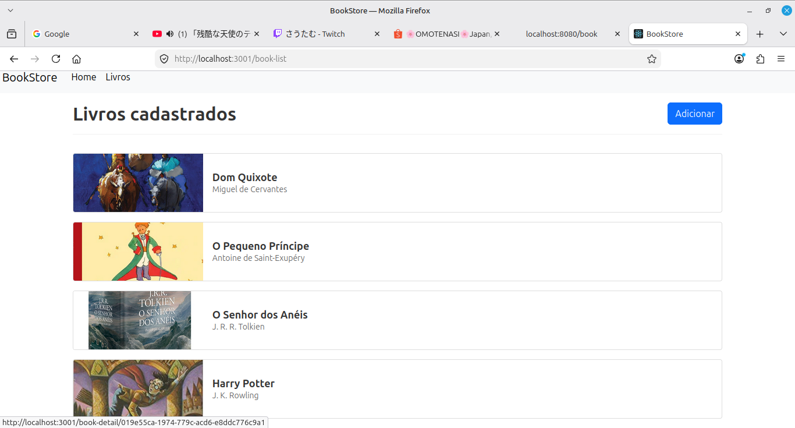
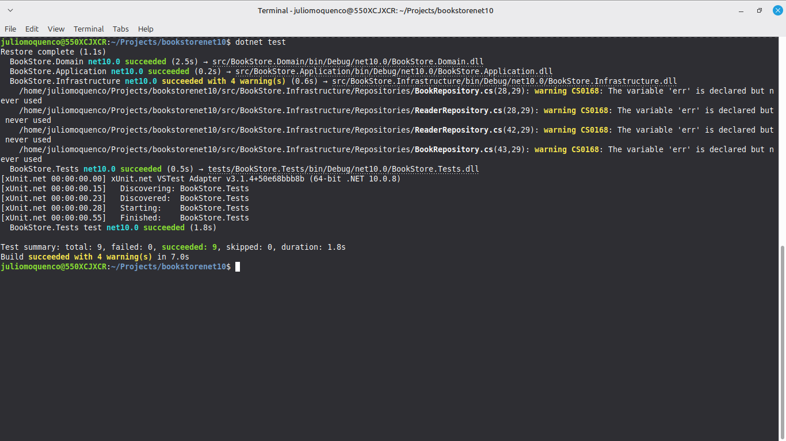

# BookStore - net10
\
*Sendo construindo sem ajuda de IA.*
\
\
**Requisitos mínimos para executar o projeto:**
\
\
Docker Desktop: 
https://docs.docker.com/desktop/
\
\
**Comandos para buildar e executar o projeto**

### *Backend:*
cd src
\
docker compose build
\
docker compose up
\
\
**Aplicação backend sendo executada, url sendo utilizada para teste:** 
http://localhost:8080/api/book
\
\

### *Frontend utilizando React:*
cd front
\
docker build -t frontendapp .
\
docker run -p 3001:3000 frontendapp
\
\
**Aplicação frontend sendo executada, url sendo utilizada para teste:** 
http://localhost:3001/
\
\

### *Resultado de alguns testes unitarios:*
Testa alguns cenários, se é possível inserir faltandos alguns campos, campos de textos não podem estar vazios.
\
\
